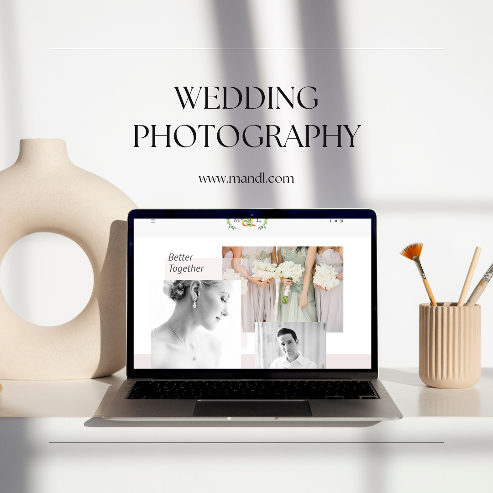
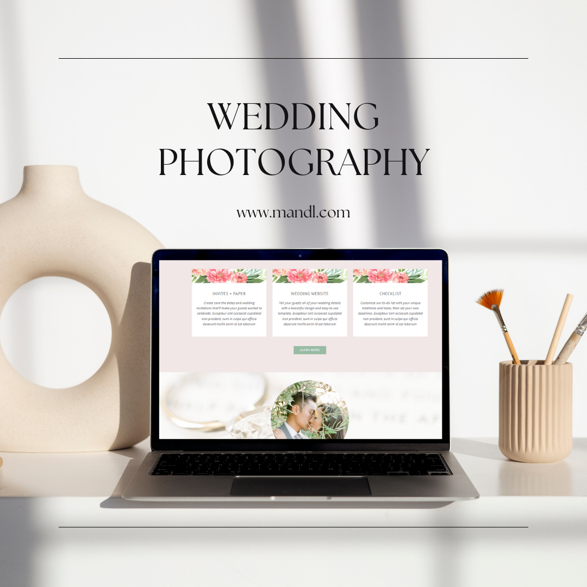

<div align="center">
M&L
  <br />
  <a href="#getting-started"><strong>Getting Started »</strong></a>
  <br />
  <br />
  <a href="https://github.com/mohras148/REPO_SLUG/issues/new?assignees=&labels=bug&template=BUG_REPORT.md&title=bug%3A+">Report a Bug</a>
  ·
  <a href="https://github.com/mohras148/REPO_SLUG/issues/new?assignees=&labels=enhancement&template=FEATURE_REQUEST.md&title=feat%3A+">Request a Feature</a>
  .
  <a href="https://github.com/mohras148/REPO_SLUG/issues/new?assignees=&labels=question&template=SUPPORT_QUESTION.md&title=support%3A+">Ask a Question</a>
</div>

<div align="center">
<br />

[](https://github.com/mohras148)

</div>

## About

> The M&L project aimed to address the need of a wedding photography service provider, M&L, for a visually appealing website to showcase their portfolio, services, and attract potential clients. The purpose of the project was to create a platform that reflects M&L's style and expertise in wedding photography, enabling them to effectively market their services and engage with prospective customers.

> By developing a WordPress website with a clean and elegant design, the project aimed to provide M&L with a solution that would allow them to exhibit their stunning wedding photographs in a gallery section. Additionally, the website included descriptions of their services and packages to provide comprehensive information to potential clients. The integration of a contact form streamlined the process for inquiries and booking requests, enhancing the user experience.

> This project set out to improve the online presence and accessibility of M&L, enabling them to effectively showcase their work and attract potential clients in the competitive wedding photography industry. It provided a platform that addressed their specific needs, stood out in terms of design and functionality, and offered an intuitive and engaging user experience.

<details>
<summary>Screenshots</summary>
<br>

|                               Home Page                               |                               About Us Page                               |
| :-------------------------------------------------------------------: | :--------------------------------------------------------------------: |
|  |  |

</details>

### Built With

**Client:** HTML, CSS, WordPress

**Server:** PHP

### Installation

To install and get started with the M&L project, follow the instructions below:

1. Requirements:
   - Ensure you have a web server installed (such as Apache or Nginx) with PHP support.
   - Have a MySQL database available.
   - Make sure you have WordPress installed on your server.

2. Download the project files:
   - Obtain the project files from the source or the provided location.

3. Extract the files:
   - Extract the downloaded project files to a directory on your local machine.

4. Configure the WordPress installation:
   - Create a new database for the project in MySQL.
   - Open the WordPress configuration file called `wp-config.php` located in the project's root directory.
   - Update the database connection details in the `wp-config.php` file, including the database name, username, password, and host.

5. Upload the project files to the server:
   - Upload the extracted project files to the root directory of your WordPress installation on the web server. This can usually be done using an FTP client or through your hosting provider's file manager.

6. Access the WordPress admin panel:
   - Open a web browser and navigate to the URL of your WordPress installation.
   - Follow the WordPress installation prompts to set up the site, including creating an admin account.

7. Activate the project theme:
   - Once logged into the WordPress admin panel, go to "Appearance" and click on "Themes".
   - Click on "Add New" and then "Upload Theme".
   - Choose the project theme file (usually in .zip format) and click "Install Now".
   - After the theme is installed, click "Activate" to make it active on your website.

8. Import project content:
   - If provided, import the sample content XML file into your WordPress installation to populate the website with demo content. This can usually be done through the "Tools" section in the WordPress admin panel.

9. Customize the website:
   - Use the WordPress theme customization options to modify the appearance, such as colors, fonts, and logo.
   - Replace the sample content with your own photographs, descriptions, and services in the WordPress admin panel.

10. Test the website:
   - Open a web browser and navigate to your website's URL to ensure everything is working correctly.


## Usage

To use the M&L project in your own code, follow the steps below:

1. Copy the project files:
   - Copy the necessary project files.

2. Import the core:
   - In your code, import the `core` from the M&L project. The exact import statement may depend on the file structure and location of the `core.js` file. Here's an example assuming it is in the same directory:

```javascript
import core from './core';
```

3. Use the core in your code:
   - Once imported, you can use the `core` in your own code. Here's an example using the `core` within a React functional core:

```javascript
import React from 'react';
import core from './core';

function App() {
  return (
    <div>
      <core />
    </div>
  );
}

export default App;
```

4. Customize the core:
   - If needed, you can customize the `core` according to your requirements. This may involve modifying the code within the `core.js` file or passing props to the core for dynamic behavior. Consult the documentation or source code of the M&L project for specific customization options.

5. Render the App:
   - Finally, render the `App` core or the root core of your application to see the `core` in action. This can be done using the `ReactDOM.render()` method.

```javascript
import React from 'react';
import ReactDOM from 'react-dom';
import App from './App';

ReactDOM.render(
  <React.StrictMode>
    <App />
  </React.StrictMode>,
  document.getElementById('root')
);
```

Use Cases:
- Displaying M&L's portfolio: The `core` can be used to showcase M&L's stunning wedding photographs by rendering it within a page or section dedicated to displaying the portfolio.

```javascript
import React from 'react';
import core from './core';

function PortfolioPage() {
  return (
    <div>
      <h1>Portfolio</h1>
      <core />
    </div>
  );
}

export default PortfolioPage;
```

- Integrating with a contact form: The `core` can be combined with a contact form to create a complete solution for potential clients to view the portfolio and submit inquiries or booking requests.

These are just a couple of examples of how you can use the M&L project's `core` in your own code. Adapt the code to fit your specific use cases and requirements, and explore the project's documentation or source code for additional functionality and customization options.

## Features
Features of the M&L Project:

1. Visually appealing design: The M&L project offers a clean and elegant design for the website, ensuring a visually appealing presentation of M&L's wedding photography portfolio.

2. Showcase stunning photographs: The project includes a gallery section where M&L can showcase their impressive wedding photographs. This feature allows potential clients to browse and appreciate their work.

3. Service and package descriptions: The website provides detailed descriptions of M&L's services and packages. This information helps potential clients understand the range of services offered and make informed decisions.

4. Integrated contact form: The project incorporates a contact form that enables potential clients to easily reach out to M&L. This feature streamlines the communication process and facilitates inquiries and booking requests.

5. WordPress platform: The project is built on WordPress, a widely used and user-friendly content management system. This ensures ease of use, flexibility, and access to a wide range of WordPress plugins and themes.

6. Customizable design: As a developer, you can customize the design of the website according to M&L's preferences. This flexibility allows you to tailor the website to reflect their unique style and expertise in wedding photography.

7. Responsive across devices: The website developed in the project is responsive, meaning it is optimized to adapt and display correctly on different devices such as desktops, tablets, and mobile phones. This ensures a seamless user experience regardless of the device used to access the website.

8. Integration of WordPress features: Leveraging the capabilities of WordPress, the project enables easy management of website content, such as adding new pages, blog posts, and image uploads, through the WordPress admin panel.

9. PHP, HTML, and CSS technologies: The project utilizes PHP, HTML, and CSS as core technologies to develop the WordPress website. These technologies provide the foundation for creating dynamic and visually appealing web pages.

10. Portfolio-focused design: The project's design and layout are specifically tailored to highlight M&L's portfolio. This emphasis on showcasing their work helps to attract potential clients and demonstrate the quality of their wedding photography services.

11. Clear documentation: The project includes clear and comprehensive documentation, making it easier for developers to understand and work with the codebase. This documentation facilitates the installation, customization, and further development of the website.

## FAQ

**Can I customize the design of the M&L website further?**

Yes, as an expert developer, you have the flexibility to customize the design of the M&L website. Since the project is built on WordPress, you can leverage WordPress themes and plugins to modify the design according to M&L's preferences. Additionally, you can make changes to the CSS and HTML code to achieve a more tailored look.

**Are there any limitations on the number of photographs I can showcase in the gallery section?**

There are no specific limitations on the number of photographs you can showcase in the gallery section of the M&L website. You can add as many photographs as you need to adequately represent M&L's wedding photography portfolio. However, keep in mind that a large number of images may affect the website's loading time. It is recommended to optimize the images for web and consider implementing pagination or a filtering mechanism if necessary.

**Can I extend the functionality of the contact form?**

Yes, you can extend the functionality of the contact form in the M&L website. Since the project is built on WordPress, you have the option to utilize WordPress plugins or develop custom code to add additional features to the contact form. You can enhance it with features like validation, email notifications, spam protection, or integration with third-party customer relationship management (CRM) systems. Consider exploring the wide range of available WordPress contact form plugins and customization options to meet specific requirements.

**Is it possible to integrate social media sharing buttons on the website?**

Yes, you can integrate social media sharing buttons on the M&L website. WordPress offers various plugins that allow easy integration of social media buttons into your website. These plugins typically provide customizable sharing options for popular social media platforms like Facebook, Twitter, Instagram, and Pinterest. By adding social media sharing buttons, you can enable visitors to easily share M&L's portfolio or blog posts on their social media profiles, increasing the reach and visibility of their work.

**Can I add a blog section to the M&L website?**

Absolutely! As an expert developer, you can add a blog section to the M&L website. WordPress provides built-in features for creating and managing blog posts. By utilizing WordPress's blogging capabilities, you can add a separate blog section or incorporate a blog feed on the existing website. This allows M&L to share valuable insights, tips, and updates related to wedding photography, enhancing engagement with potential clients and improving the website's overall content strategy.
